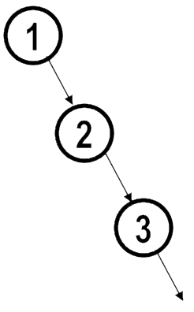

# Trees (generic)
> ## Binary Trees
>> ## Binary Search Trees


https://github.com/itamames/Lecture8

## Preliminaries. Generic Trees  

A tree is a collection of nodes. 

The collection can be empty; otherwise, a tree consists of a special node r, called the root, and zero or more nonempty (sub)trees T<sub>1</sub>, T<sub>2</sub>, . . . , T<sub>k</sub>. 

Each of whose roots are connected by a directed edge from r.

The root of each subtree is said to be a child of r, and r is the parent of each subtree root.


Image from : https://www.geeksforgeeks.org/introduction-to-tree-data-structure-and-algorithm-tutorials/

## Basic Terminologies In Tree Data Structure:
* Parent Node: The node which is a predecessor of a node is called the parent node of that node. {B} is the parent node of {D, E}.
* Child Node: The node which is the immediate successor of a node is called the child node of that node. Examples: {D, E} are the child nodes of {B}.
* Root Node: The topmost node of a tree or the node which does not have any parent node is called the root node. {A} is the root node of the tree. A non-empty tree must contain exactly one root node and exactly one path from the root to all other nodes of the tree.
* Leaf Node or External Node: The nodes which do not have any child nodes are called leaf nodes. {K, L, M, N, O, P} are the leaf nodes of the tree.
* Ancestor of a Node: Any predecessor nodes on the path of the root to that node are called Ancestors of that node. {A,B} are the ancestor nodes of the node {E}
* Descendant: Any successor node on the path from the leaf node to that node. {E,I} are the descendants of the node {B}.
Sibling: Children of the same parent node are called siblings. {D,E} are called siblings.
* Level of a node: The count of edges on the path from the root node to that node. The root node has level 0.
* Internal node: A node with at least one child is called Internal Node.
* Neighbour of a Node: Parent or child nodes of that node are called neighbors of that node.
* Subtree: Any node of the tree along with its descendant.

## Properties of a Tree:
* Number of edges: An edge can be defined as the connection between two nodes. If a tree has N nodes then it will have (N-1) edges. There is only one path from each node to any other node of the tree.
* Depth of a node: The depth of a node is defined as the length of the path from the root to that node. Each edge adds 1 unit of length to the path. So, it can also be defined as the number of edges in the path from the root of the tree to the node.
Height of a node: The height of a node can be defined as the length of the longest path from the node to a leaf node of the tree.
* Height of the Tree: The height of a tree is the length of the longest path from the root of the tree to a leaf node of the tree.
Degree of a Node: The total count of subtrees attached to that node is called the degree of the node. The degree of a leaf node must be 0. The degree of a tree is the maximum degree of a node among all the nodes in the tree.

## Some more properties are:

* Traversing in a tree is done by depth first search and breadth first search algorithm.
* For any node n<sub>i</sub>, the depth of ni is the length of the unique path from the root to n<sub>i</sub>. Thus, the root is at depth 0. 
* The height of ni is the length of the longest path from n<sub>i</sub> to a leaf. Thus all leaves are at height 0. The height of a tree is equal to the height of the root.
* The depth of a tree is equal to the depth of the deepest leaf.

# Implementation of Trees  

Trivial idea:

To have each node, besides its data, a link to each child of the node. 

But: 

The number of children per node can vary so greatly and is not known in advance! 

Simple solution:
Keep the children of each node in a linked list of tree nodes.
```java
class TreeNode
{
    Object element;
    TreeNode firstChild;
    TreeNode nextSibling;
}
```


Arrows that point downward are firstChild links. Horizontal arrows are nextSibling links. Null links are not drawn, because there are too many.

Example: Node E has both a link to a sibling (F) and a link to a child (I), while some nodes have neither.

## Tree Traversals with an Application


Example of application for trees:
The directory structure in many common operating systems, including UNIX and DOS.

The asterisk next to the name indicates that /usr is itself a directory.

The filename /usr/mark/book/ch1.r is obtained by following the leftmost child three times. Each / after the first indicates an edge; the result is the full pathname.

If we need to list the names of all of the files in the directory. Our output format will be that files that are depth di will have their names indented by di tabs.
```java
private void listAll( int depth )
{
 	   printName( depth ); // Print the name of the object
 	   If ( isDirectory( ) )
 	        for each file c in this directory (for each child)
 	             c.listAll( depth + 1 );
}
public void listAll( )
{
       listAll( 0 );
}
```
Logic: The name of the file object is printed out with the appropriate number of tabs. If the entry is a directory, then we process all children recursively, one by one. These children are one level deeper and thus need to be indented an extra space.

## Tree Traversals – Preorder Traversal

In a preorder traversal, work at a parent is performed before (pre) its children are processed.

Preorder:  root, most left-subtree, …, most right-subtree

Preorder traversal: A, B, C, D, H, E, I, J, P, Q, F, K, L, M, G, N

The preorder traversal is O(N)


## Tree Traversals – Postorder Traversal

In a postorder traversal, work at a node is performed after (post) its children are evaluated.

Postorder:  most left-subtree, …, most right-subtree, root

Example:

Postorder traversal: B, C, H, D, I, P, Q, J, E, K, L, M, F, N, G, A

The postorder traversal is O(N)

# Binary Trees


A binary tree is a tree-type non-linear data structure with a maximum of two children for each parent. Every node in a binary tree has a left and right reference along with the data element. 

For binary tree of height h:

* max number of leaves: 2<sup>h <sup>

* max number of nodes: 2<sup>h+1<sup> -1

* min number of leaves: 1

* min number of nodes: h +1

For N nodes, min height is O(logN) and we want to avoid height = O(N) (max height)


## Implementation of Binary Trees

The declaration of tree nodes is similar in structure to that for doubly linked lists.

A node is a structure consisting of the element information plus two references (left and right) to other nodes.

Binary Tree Node Class
```java
class BinaryNode
{
	Object element;		// The data in the node
	BinaryNode left; 	// Left child
	BinaryNode right; 	// Right child
}
```

More extensive implementation:
```java
private static class BinaryNode<AnyType>
{
    AnyType element; // The data in the node
    BinaryNode<AnyType> left; // Left child
    BinaryNode<AnyType> right; // Right child
             
    // Constructors
    BinaryNode( AnyType theElement )
        {  this( theElement, null, null );  }

    BinaryNode( AnyType theElement, 
        BinaryNode<AnyType> lt,  
        BinaryNode<AnyType> rt )
        { element = theElement; left = lt; right = rt; }
}
```

# Expressions Trees (example of Binary Trees)

The leaves of an expression tree are operands and the other nodes contain operators.

The expression trees are binary, (in the majority of cases all the operators are binary).

It is also possible for a node to have only one child, as is the case with the unary minus operator.

How to evaluate an expression tree?

Applying the operator at the root to the values obtained by recursively evaluating the left and right subtrees. 


Left subtree: a + (b * c)

Right subtree: ((d * e) + f) * g 

The full tree represents: 
```text
(a + (b * c)) + (((d * e) + f) * g)
```
## Expressions Trees (inorder, postorder,  and preorder traversals)

Inorder traversal: (left, node/root, right)

    (a + (b * c)) + (((d * e) + f) * g) //infix notation

Postorder traversal: (left, right, node/root)

    a b c * + d e * f + g * +		//postfix notation

Preorder traversal: (node/root, left, right)

    + + a * b c * + * d e f g		//prefix notation

# Binary Search Trees (BST)

For simplicity, let assume that each node in the tree stores an integer and also assume that all the items are distinct.

Definition: A binary tree is a binary search tree is that for every node, X, in the tree: 
* the values of all the items in its left subtree are smaller than the item in X.
* the values of all the items in its right subtree are larger than the item in X. 

## Binary Search Trees. Add
To insert(add) x into BST T proceed down the tree as you would with a contains. 
* (i) If x is found, do nothing.
* (ii) Otherwise, insert x at the last spot on the path traversed.

Example: insert(5)


```java
/**
 	*  Internal method to insert into a subtree.
 	*  @param x the item to insert.
 	*  @param t the node that roots the subtree.
 	*  @return the new root of the subtree.
 	*/
  	private BinaryNode<AnyType> insert( AnyType x, BinaryNode<AnyType> t )
 	 {
              if( t == null )
                return new BinaryNode<>( x, null, null );
              int compareResult = x.compareTo( t.element );
              if( compareResult < 0 )
                   t.left = insert( x, t.left );
              else if( compareResult > 0 )
                   t.right = insert( x, t.right );
              else
                   ; // Duplicate; do nothing
              return t;
         }

```

## Binary Search Trees. Remove

As is common with many data structures, the hardest operation is deletion.

* (i) If the node is a leaf, it can be deleted immediately. 

* (ii) If the node has one child, the node can be deleted after its parent adjusts a link to bypass the node

Example: remove(4)


* (iii) If the node has more than one children. 
Replace the data of this node with the smallest data of the right subtree (which is easily found)
Recursively delete that node (which is now empty).

Example (alternative): remove(23)


```java
/**
 	* Internal method to remove from a subtree.
	 * @param x the item to remove.
 	* @param t the node that roots the subtree.
 	* @return the new root of the subtree.
 	*/
 	private BinaryNode<AnyType> remove( AnyType x, BinaryNode<AnyType> t )
 	{
              if( t == null )
                 return t; // Item not found; do nothing
             int compareResult = x.compareTo( t.element );
             if( compareResult < 0 )
                   t.left = remove( x, t.left );
             else if( compareResult > 0 )
                   t.right = remove( x, t.right );
             else if( t.left != null && t.right != null ) // Two children
             {
                  t.element = findMin( t.right ).element;
                  t.right = remove( t.element, t.right );
              }
             else
                  t = ( t.left != null ) ? t.left : t.right;
             return t;
          }

```
Binary tree animation:

https://www.cs.usfca.edu/~galles/visualization/BST.html

Sample implementation by Weiss:

http://users.cis.fiu.edu/~weiss/cop3530_sum09/Day13.java

# Running time

For the BST, Insert and Remove are O(N) (worst case)

## Building a BST (buildBST)

Suppose we need to build a BST from de following ordered sequence of integers:

1, 2, 3, 4, 5, 6, 7, 8, 9

How to insert this sequence into an empty BST? 

First option: insert the elements in a given order. 
* What’s the tree? 
	* Not a good tree! (we want to 
		avoid height = N (max height)
* What the running time? 
	* O(N<sup>2</sup>)




Second option: insert the elements in the reverser order?

Third option: re-arrange elements: median first, then left median, right median, etc. (5, 3, 7, 2, 1, 4, 8, 6, 9)

* What’s the tree? 
    * Good tree! (balanced tree) 
		
* What the running time? 
   * O(NlogN) for building the BST!!!


Important: The expected depth of any node is O(logN)


# Applications of Binary Trees (BT) and BST

A BST is a prominent data structure used in many systems programming applications for representing and managing dynamic sets. 
* Average case complexity of Find, Insert, and Remove operations is O(logN), where N is the number of nodes in the tree.

Examples:

A Binary Search Partition is used in almost every 3D video game to determine what objects need to be rendered.

A BT is constructed by compilers and (implicitly) calculators to parse expressions.

 # Class Practice

https://github.com/itamames/Lecture8

Given a binary tree, check if it is a sum tree or not. In a sum tree, each non-leaf node’s value is equal to the sum of all elements present in its left and right subtree. 

The value of a leaf node can be anything and the value of an empty child node is considered to be 0.

For example, the following binary tree is a sum tree.


We can easily solve this problem by using recursion. 

The idea is to traverse the tree in a postorder fashion. For each non-leaf node, check if the node’s value is equal to the sum of all elements present in its left and right subtree. 

If this relation does not hold for any node, then the given binary tree cannot be a sum tree.

Either copy paste this code or open Main.java in the GtiHub folder.

```java
// A class to store a binary tree node
class Node
{
    int key;
    Node left = null, right = null;
 
    Node(int key) {
        this.key = key;
    }
}
 
class Main
{
    // Recursive function to check if a given binary tree is a sum tree or not
    public static int isSumTree(Node root)
    {
        //TODO
 
        return Integer.MIN_VALUE;
    }
 
    public static void main(String[] args)
    {
        /* Construct the following tree
                 44
                /  \
               /    \
              9     13
             / \    / \
            4   5  6   7
        */
 
        Node root = new Node(44);
        root.left = new Node(9);
        root.right = new Node(13);
        root.left.left = new Node(4);
        root.left.right = new Node(5);
        root.right.left = new Node(6);
        root.right.right = new Node(7);
 
        if (isSumTree(root) != Integer.MIN_VALUE) {
            System.out.println("Binary tree is a sum tree");
        }
        else {
            System.out.println("Binary tree is not a sum tree");
        }
    }
}

```
